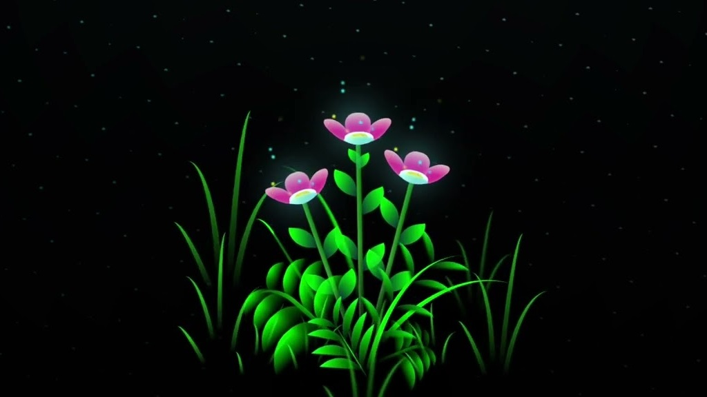

# My Projects Portfolio



A modern, dark-themed portfolio website showcasing my creative web development projects with stunning visual effects.

## Features

- 🎆 Dark theme with cyberpunk-style glowing effects
- 🖥️ Responsive design for all screen sizes
- 🚀 Animated project cards with hover effects
- 🌈 Gradient text and background effects
- 📱 Font Awesome icons integration
- ✨ Smooth CSS animations and transitions

## Technologies Used

- HTML5
- CSS3 (Flexbox, Grid, Animations)
- Font Awesome Icons
- Google Fonts (Poppins)

## Projects Showcased

1. **Animated Login Form**
   - Modern UI design
   - Interactive elements
   - Smooth animations
   - User-friendly interface

2. **Glowing Digital Flower**
   - CSS art creation
   - Complex animations
   - Gradient effects
   - Visual storytelling

## Getting Started

1. Clone the repository:
   ```bash
   git clone https://github.com/fibergoddev/Sagar-Projects.git
